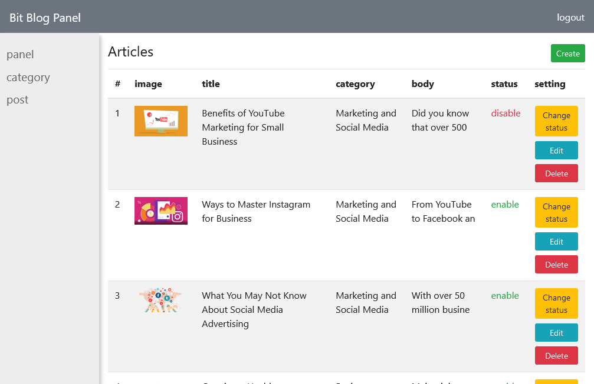

# Bit Blog
simple PHP blog

## Table of Contents
* [General Info](#general-information)
* [Technologies Used](#technologies-used)
* [Features](#features)
* [Screenshots](#screenshots)
* [Setup](#setup)
* [Usage](#usage)
* [Project Status](#project-status)
* [Contact](#contact)
<!-- * [License](#license) -->

## General Information

A BitBlog ("weblog") is a simple online journal that can be run by a single person and provides regular updates (blog posts) on various topics.
 
and
presents posts in reverse chronological order , and written with PHP 8.1

## Technologies Used
- PHP 8.1.10

## Features
List the ready features here:
- create , read , update and delete posts
- Change Status (enable or disable)
- Create & Edit Categories 
- View Details

## Screenshots

## Setup
1. Install XAMPP or WAMPP

2. Open XAMPP Control panal and start [apache] and [mysql] .

3. Download project from github(https://github.com/MobinaJafarian/BitBlog)  
    OR follow gitbash commands
    
    i>cd C:\\xampp\htdocs\
    
    ii>git clone https://github.com/MobinaJafarian/BitBlog.git
    
4. extract files in C:\\xampp\htdocs\.

5. open link localhost/phpmyadmin

6. click on new at side navbar.

7. give a database name as (bit-blog) hit on create button.

8. after creating database name click on import.

9. browse the file in directory
[BitBlog/assets/database/bit-blog.sql].

10. after importing successfully.

11. open any browser and type http://localhost/BitBlog/

12. first register and then login

13. admin login details: 
- Email = admin@gmail.com 
- Password = 123456

## Usage

`php -S localhost:8000`

## Project Status
Project is: _complete_ 

## Contact
Created by [@MobinaJafarian](https://github.com/MobinaJafarian) - feel free to contact me!

<!-- Optional -->
<!-- ## License -->
<!-- This project is open source and available under the [... License](). -->

